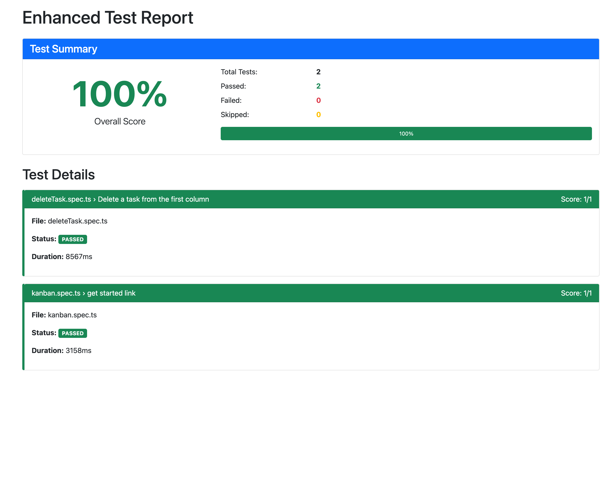

# Kanban App Test Scenarios

This repository documents test steps for validating key functionalities in a Kanban board application.

## 📋 Test Scenarios

### ✅ Edit a Kanban Card

**Steps:**
1. Navigate to the Kanban app.
2. Choose a card that:
   - Has subtasks that are not completed.
   - Is **not** in the first column.
3. Complete one of the subtasks.
4. Move the card to the **first column**.
5. Verify that the completed subtask is **struck through**.
6. Close the card edit page.
7. Verify that the number of completed subtasks is **correct**.
8. Verify that the card has moved to the **correct column**.

---

### 🗑️ Delete a Kanban Card

**Steps:**
1. Open the Kanban app.
2. Delete a Kanban card.
3. Verify that the card is **no longer present** on the board.
4. Verify that the number of cards in the **relevant column is updated** accordingly.

---

## 🧪 Notes

TO RUN THE TEST
- npm run test tests/kanban.spec.ts
- npm run test tests/deleteTask.spec.ts

TO GENERATE AND OPEN REPORT
- npm run test:report
- open enhanced-report/enhanced-report.html

TO RUN THE KANBAN TEST 5 TIMES
- npm run test tests/kanban.spec.ts --repeat-each=5

### 📷 Sample Enhanced Test Report

